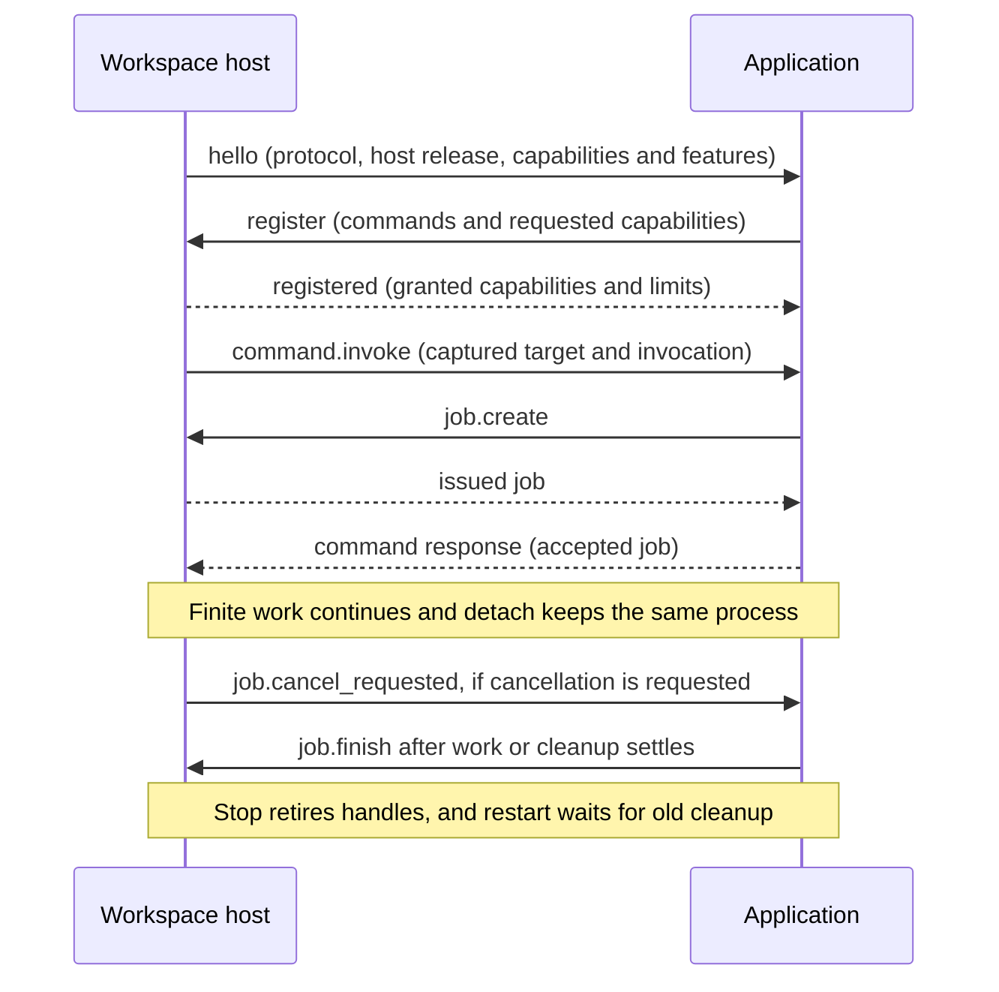

# Author an application plugin

A Runyte application is an explicitly enabled program that exchanges bounded
JSON messages with one workspace host. It can use native views, commands, input,
jobs and document operations without implementing a terminal renderer or linking
to Rust. Start with the public [application contract](applications.md),
[stable schema](runyte-1.schema.json) and
[conformance guide](conformance.md). The bundled frontend transport and testing
facades are not extension APIs.

## Try two local examples from a clean checkout

The following creates an isolated demo workspace and configuration. It requires
Python 3.10+ and the Rust toolchain required by the checkout; the examples need
no Python packages, credentials or network services. Run these commands from the
repository root after cloning Runyte:

```sh
cargo build --locked --release
plugin_checkout="$(pwd -P)"
plugin_demo="$(mktemp -d "${TMPDIR:-/tmp}/runyte-plugin-demo.XXXXXX")"
python3 - "$plugin_checkout" "$plugin_demo" <<'PY'
import json
from pathlib import Path
import sys

checkout, demo = map(Path, sys.argv[1:])
workspace = demo / 'workspace'
workspace.mkdir()
(workspace / 'notes.txt').write_text('A local file for the plugin demo.\n')
python = str(Path(sys.executable).resolve())
plugins = []
for name, capabilities in [
    ('files', ['views', 'filesystem', 'documents', 'interaction', 'jobs']),
    ('jobs', ['jobs']),
]:
    plugins.append({
        'id': name, 'enabled': True, 'api': 'runyte-1', 'runyte': '>=0.3.0, <0.4.0',
        'executable': python,
        'args': [str(checkout / 'docs' / 'plugins' / (name + '.py'))],
        'capabilities': capabilities,
    })
# JSON is valid YAML; every executable and script path here is absolute.
(demo / 'config.yaml').write_text(json.dumps({'plugins': plugins}, indent=2) + '\n')
print('Demo directory:', demo)
PY
cd "$plugin_demo/workspace"
"$plugin_checkout/target/release/runyte" --config "$plugin_demo/config.yaml" --init "$plugin_demo/workspace"
```

`--init` makes this non-Git directory the exact standalone workspace root.
In this new editor, `::files .` opens the local file manager.
Enter opens its selected ordinary file or directory; Tab lists available actions.
`::files-new` prompts for a filename and then presents the native filesystem
confirmation. Escape cancels that confirmation without creating the file.
`::jobs-start` starts a twelve-second task; editing remains available and
`::jobs-cancel` requests cancellation. `:plugins` shows lifecycle details.

No existing TUI or persistent session is needed. The automated checks below run
without opening one. For an existing persistent host, configuration changes require
a host restart with the same configuration path; plugin restart reloads the
already configured program, not a newly edited configuration.

[files.py](files.py) and [jobs.py](jobs.py) import the neighboring
[application.py](application.py). Keep that file beside an example when copying
it elsewhere. Python runs the script directly, so executable permission is
unnecessary. Runyte passes arguments exactly: no shell, `~` expansion or variable
expansion occurs in configuration. The plugin's working directory is the
workspace root. Disabled entries start no program and trigger no bundle scan.

## Write a command using the Python client

For the same native application implemented in three languages, try the
[todo showcase](todo/README.md). Its Python, Rust and C variants support adding,
toggling, removing and filtering tasks. A build helper generates a configuration
for all three, and a shared wire suite checks their behavior.

The optional client handles the handshake, request IDs, response correlation,
bounded dispatch and ordered observation callbacks. Every host method remains
available through `app.request(method, **params)`; convenience methods add model
staging, snapshots, subscriptions, managed binary pipes and state operations.
Its output lane remains bounded while the host stops reading. A local delivery
timeout closes the connection to prevent queued late operations; explicitly
restart before issuing new requests. Host-returned errors remain ordinary
responses. A disconnected or timed-out state mutation can still be uncertain,
so restart alone is not permission to replay it.

```python
from application import Application

app = Application('Example', [
    {'name': 'show', 'alias': 'example', 'description': 'Show the example page', 'context': 'workspace'},
], ['views'], runyte='>=0.3.0, <0.4.0')

def show(context):
    result = app.request('view.create', model={
        'title': 'Example', 'purpose': 'document',
        'rows': [{'id': 'welcome', 'text': 'Hello from an application',
                  'role': 'ordinary'}],
    })
    app.request('pane.show', invocation=context['invocation'], view=result['view'])

app.handlers = {'show': show}
if __name__ == '__main__':
    app.run()
```

Each invocation creates a separate bounded page. Close pages you no longer need;
the host limits the number retained by one owner. For a shared, revision-checked
model, use the ownership pattern in [tasks.py](tasks.py) or [catalog.py](catalog.py).
Keep the reader and cancellation callbacks responsive; schedule bounded work and
signal cancellation rather than waiting in those callbacks. Do not hold a lock
while waiting for a callback that needs the same lock. Reserve stdout for the
wire protocol, and keep diagnostic output free of request bodies, secrets and
raw helper output.

Commands declare `workspace`, `buffer` or `view` context and typed positional
arguments. The configured ID supplies the internal `plugin.<id>.` command prefix.
An optional `alias` supplies the short name after `::`: the example above
registers `::example`, independently of its configured ID. Completion and
key hints read the same registration. See the
[alias collision rules](../plugins.md#plugin-command-names). Command names such as `stop` are reserved by Runyte; use a distinct action name such as
`stop-playback`. Registration, configured bindings and capability negotiation
must succeed before a command becomes available.

The independent [tasks.mjs](tasks.mjs) example uses Node.js 18+ built-ins without the
Python client or an npm dependency. Configure it with ID `node-tasks`, an absolute
Node executable, the absolute script path, `api: runyte-1`, its release range and `capabilities: [views]`.
`::node-tasks` shows its checklist; Enter invokes `toggle` for the
selected row. Its [public-wire check](check_node.py) exercises another language's
reader and response correlation. An ambiguous model publication makes this
example unavailable until explicit plugin restart; it never retries the mutation.

## Lifetimes and authority



An accepted command, a job, a view and a provider document have separate
lifetimes. Return an already issued job when work exceeds the command deadline.
Install cancellation bookkeeping before work can start; cancellation can arrive
before the `job.create` caller resumes. Keep a bounded record of such early
events. Report a terminal state after cleanup, and preserve `outcome_unknown`
when a remote mutation may have happened. Never retry a mutation because its
response was lost.

An invocation authorizes a foreground action only while its attachment, pane,
target and input generation still match. A completed command or accepted job
does not retain that authority. A background task can update an existing view;
showing a pane, opening input or making an external handoff needs fresh authorized
input. `ui.submit` is a new host request; an accepted native submission supplies
its own invocation. Cancellation supplies no replacement foreground grant.

Keep target handles and expected revisions with work. Never infer a destination
from whichever buffer happens to be active at completion. Treat `stale`,
`context_changed`, `closed` and `no_frontend` as ordinary refusal paths. Refresh
metadata or request a new explicit action as appropriate; do not silently apply
the same edit to a newer revision.

Use `event.subscribe` for metadata invalidation. Install its baseline before
processing subsequent updates, and resynchronize on `event.resync_required`.
The Python client's `event.baseline` callback is a local convenience, not a wire
event. Coalesced metadata is not an edit log. Fetch text, selections or models
through explicit revision-bound reads.

Use finite jobs for finite work and activity leases for deliberate continuing
work. A lease is renewable for at most 600 seconds at a time. Stop playback or
other owned work before acknowledging its cancellation; releasing a lease does
not itself stop a helper. Paused or quiescent applications should release
protection and have no periodic refresh loop. Host-managed helpers stop with
their owner; installed native terminal sessions follow editor retention instead.

## Public method and event index

The schema describes exact shapes. These groups locate their behavioral contract;
listing a capability here does not grant it. Required capabilities must also be
enabled in configuration. Subscription permissions depend on the selected source.

| Capability | Plugin requests | Contract |
| --- | --- | --- |
| `workspace` | `workspace.info`, `buffer.list`, `pane.list` | [Targets](applications.md#wire-contract) |
| `text` | `buffer.read/edit`, `buffer.snapshot.open/read/close` | [Text and snapshots](applications.md#editor-operations-and-memory) |
| `selections` | `selection.get/set` | [Explicit pane selections](applications.md#editor-operations-and-memory) |
| `views` | `view.create/get/publish/patch/close`, `view.stage.open/write/commit/close`, `view.snapshot.open/read/close`, `view.query.set`, `pane.show` | [Models](applications.md#columns-blocks-and-atomic-model-updates), [queries](applications.md#explicit-queries-and-observed-views) |
| Source-dependent | `event.subscribe/resync/unsubscribe` | [Subscriptions](applications.md#source-subscriptions) |
| `jobs` | `job.create/get/update/finish/cancel` | [Finite jobs](applications.md#wire-contract) |
| `interaction` | `ui.form/prompt/pick/confirm/dismiss` | [Input and validation](applications.md#native-input) |
| `filesystem` | `filesystem.stat/list/prepare/cancel/release`, `staging.close` | [Local files](applications.md#local-file-manager) |
| `filesystem` + `jobs` | `filesystem.apply`, `staging.create/prepare` | [Confirmed downloads](applications.md#binary-downloads-and-confirmed-publication) |
| `documents` | `buffer.open/create/close` | [Document lifecycle](applications.md#local-file-manager) |
| `documents` + `jobs` | `buffer.save`, `resource.open/rebind/inspect` | [Provider documents](applications.md#provider-backed-documents) |
| `providers` | `provider.register` | [Provider callbacks](applications.md#provider-backed-documents) |
| `processes` | `process.start/get/read/write/close` | [Managed helpers](applications.md#managed-helpers) |
| `activity` | `activity.acquire/renew/get/release/cancel` | [Continuing work](applications.md#continuing-activity) |
| `terminals`, `external`, `notifications` respectively | `terminal.open`, `external.open`, `notification.publish` | [Handoffs and feedback](applications.md#notifications-and-native-handoffs) |
| `settings`, `state` respectively | `settings.get`, `state.get/set/delete` | [Settings and persistence](applications.md#settings-and-workspace-state) |

Host requests are `command.invoke`, `ui.submit`, `ui.validate`, and the provider
callbacks `resource.stat/read/reconcile` and
`resource.write.begin/chunk/commit/abort`. They require responses, unlike events.

| Wire events | Meaning |
| --- | --- |
| `job.changed`, `job.cancel_requested` | Finite job lifecycle and cooperative cancellation |
| `view.closed` | Owned view closed or evicted |
| `filesystem.started`, `filesystem.finished` | Native confirmed operation lifecycle |
| `resource.opened`, `resource.saved`, `resource.inspected` | Asynchronous document operation completion |
| `resource.released` | Provider can release the named operation's cached data |
| `event.changed`, `event.closed`, `event.resync_required` | Ordered subscribed metadata, closure or resynchronization |
| `event.action` | Accepted action metadata; no foreground grant or duplicate command |
| `ui.validation_cancelled` | Cancel a no-longer-needed validation request |
| `activity.cancel_requested` | Stop continuing work, then release the lease |

## Budgets, persistence and migration

Read negotiated limits and the relevant operation section before retaining data.
Current hosts include `limits.resources` in both handshake messages for model,
snapshot, subscription, input and payload ceilings. That additive inventory is
required for stable hosts; use the documented
defaults if it is absent. Its values share the constants used by host admission.
Important ceilings are 1 MiB per encoded line including newline, 16 outstanding
host control requests, four active finite jobs, sixteen views, and 48 MiB of
retained host payload per owner / 160 MiB host-wide. Models have independent
4 MiB encoded and projected limits; use SDK staging and snapshot helpers instead
of sending an oversized line. Large lists use stable IDs and bounded pages.

There are 32 subscriptions and 256 subscription/source pairs per owner, one
native input surface with at most sixteen fields, four managed helpers, and two
activity leases. Text-edit offsets count Unicode scalars; provider/model chunk
offsets count UTF-8 bytes; managed pipes contain bytes. Count JSON escaping and
envelope overhead separately. These host payload limits do not bound your
process's memory: cap its queues, workers, caches and response bodies yourself.
An operation's temporary reservation can exceed its final data size, so a valid
small message can still receive `busy` or `limit_exceeded` under load.

The stable protocol is `runyte-1`. Explicit `api` and a bounded `runyte`
release range are required in configuration and registration. Experimental epochs
are no longer accepted. See [compatibility](compatibility.md) for release,
feature and schema evolution rules. Request IDs increase in send order; responses
may arrive out of order. Reacquire handles and revisions after restart; never
replay uncertain mutations automatically.

### Write a selection transformation

[uppercase.py](uppercase.py) is the minimal stable text example. Grant `text`
and `selections`, register a buffer-context command, and declare the plugin's
supported range. Its callback receives captured buffer/pane handles and revisions.
Read `selection.get` for that pane and require its buffer and selection revision
to match the invocation. Its `spans` array contains authoritative half-open
operative ranges in the same order as `ranges`; anchor/head retain direction.
Do not infer spans from min/max of the caret coordinates: native half-open,
linewise and inclusive selections have different endpoint semantics.

Read each span against the captured buffer revision, then submit one sorted,
non-overlapping `buffer.edit` changes array. The host applies one undoable
transaction or nothing. Stale/closed targets, oversized reads and refused edits
must not trigger automatic replay. The example tests cover reverse selections,
Unicode expansion, empty spans and refusal before mutation.

### Client distribution and languages

For Python, vendor the unmodified maintained `application.py` alongside the
plugin. Record its full upstream source SHA and checksums, and copy the matching
schema and fixtures into development tests. Updates are deliberate; compatible
host upgrades do not require replacing the pinned SDK. The file requires only
Python 3.10+ standard library. SDK fixes belong upstream before re-vendoring.

The independent Node, Rust and C examples demonstrate the same protocol without
Python. They are maintained runnable examples, not full reusable SDK packages.
The stable schema, behavioral contract and conformance fixtures are available to
any language. Additional packaged SDKs can follow concrete plugin demand;
PyPI/npm/Cargo SDK publication is not part of this transition.

Use an application-defined numeric version inside `state.set` documents. Read
the current revision, validate and migrate data in application code, then perform
one conditional set. A conflict needs a new read and a deliberate decision;
the SDK does not merge or migrate automatically. Settings are immutable for that
configured instance and may use a registered bounded schema. State and settings
are nonsecret; credentials belong in an established credential helper or platform
credential manager. Never persist secret fields, tokens or live resource handles.

Run the [conformance checks](conformance.md) before distributing an application.
Include tested Runyte release and protocol, Python/Node or helper versions, capability grants,
dependency installation, stop/cancel behavior and any weaker remote-write
guarantees with your own bundle.
